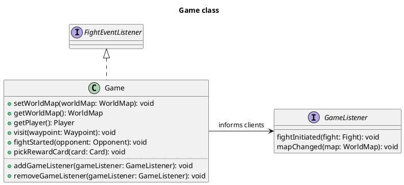
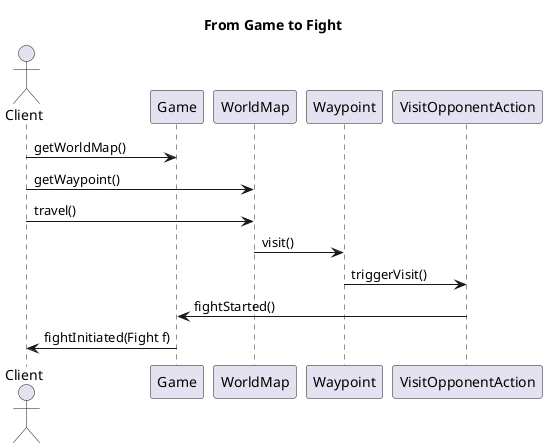
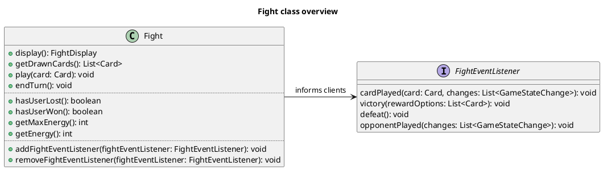
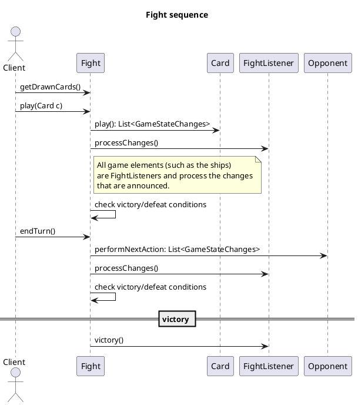
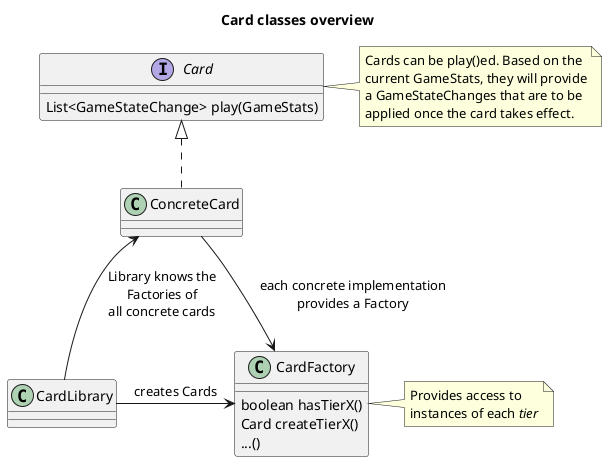
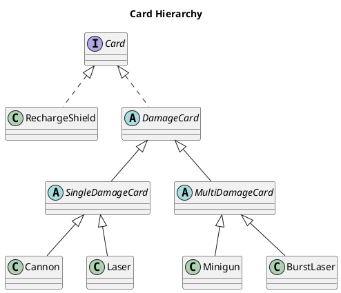
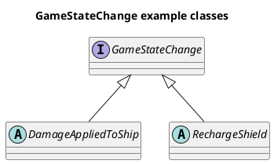
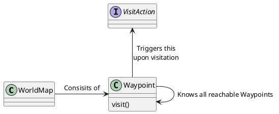

# Spacewars 2 Domain

## Overview

The following diagram provides an overview over the participating modules.

## Startup / Game class

Startup is realized by `SpaceTcgMain` which provides a number of static methods to create initial game objects,
especially a `Game` and a `Fight` (for testing parts of the application).

The client (indirectly the user) can visit `Waypoint`s which can initiate `Fight`s.

## Game Loop / Fight class

A `Fight` progresses by `play()`ing `Card`s until the the fight ends.

## Cards

Cards are a core element in Spacewars.
The player can play cards, which can have a number of effects.

Most cards come in multiple tiers.
The effects are usually the same, but more powerful.

Here's the hierarchy the cards that are available.

## Display

Classes in this package serve for describing the state of the game.
They are to be used by external clients for visualiziation, but they are also used
internally for analyzing the game state.

## GameStats.Change

Classes in this package describe changes that can occur to the world.
Those classes are rather data containers with little dependencies, they only describe the effects but do not contain the logic to apply them.

### Design rational

GameStateChange objects should not be able to alter the internals of other important game classes.
Thus those classe in turn need to be be able to process the changes.

## Map

The world conists of a `WorldMap` which in turn is a map of `Waypoint`s.
When a Waypoint is `visit()`ed, then this can trigger an action, such as the encounter of an opponent or the movement to another map (e.g. the next level).

## Opponent

Classes representing `Opponent`s

## Player

Contains the `Player`s stats and his `Deck`.

## Reward

Classes for chosing rewards, e.g. after a victory.
