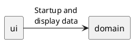

# Spacewars 2 Design

The project is split into a [domain](domain/overview.md) part and an `ui` part.

The `domain` part's goal is to contain as much logic as possible.

The `ui` part mainly serves for manual testing. 
It also contains `main()` code for initial configuration and startup.
It is expected that other `ui` clients will be developed to provide a nice looking GUI.

